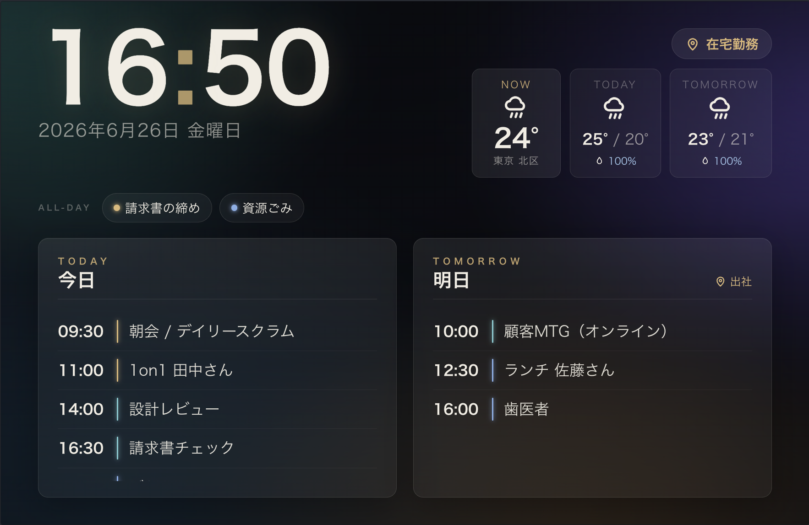

# pi-calendar-display

An always-on **Google Calendar + weather dashboard** for the Raspberry Pi (or any Linux box / PC). Connect a display, and it shows your upcoming events and the forecast full-screen, around the clock — kiosk-style, with a phone-based LAN remote.

[](LICENSE)


- 🗓 Today's & tomorrow's events at a glance, plus work location (home / office)
- 🌤 Weather forecast via [Open-Meteo](https://open-meteo.com/) (no API key, free)
- 🔆 **Automatic screen brightness** by time of day (dims at night)
- 📱 **Web remote over your LAN** from any phone (switch background, resync, screen on/off, brightness)
- 🛠 No build step + systemd daemon — built for unattended, run-forever operation

A lightweight Node proxy holds your credentials and runs locally; the display side (static HTML) holds **no** credentials and simply polls the proxy's `/api/data`. Your OAuth tokens never leave the device.



> 📖 Step-by-step Raspberry Pi setup: see **[SETUP.md](SETUP.md)**.

---

## What you need

- A Raspberry Pi (or any Linux / PC) and a display
- Node.js 18 or newer
- A Google account (for read-only calendar access)

> **Important:** the maintainer cannot set up credentials for you. Issuing the OAuth client and doing the first sign-in must be done with **your own** Google account, on **your own** device.

---

## Setup

> **No build required.** The frontend is plain HTML/CSS/JS and the proxy is pure JS (no native build), so `npm install` is all you need.

### 0. Raspberry Pi prerequisites (Node + CJK fonts)

When running on Raspberry Pi OS, set these up first — skipping them will reliably trip you up.

**Node.js 18+ (20 LTS recommended)** is required (it uses `fetch` / `AbortSignal.timeout`). The `apt` default is often too old, so install from NodeSource or nvm.

```bash
# Example: install Node 20 from NodeSource
curl -fsSL https://deb.nodesource.com/setup_20.x | sudo -E bash -
sudo apt install -y nodejs
node -v   # confirm v20.x or newer
```

**Fonts** for your language. Without CJK fonts, Japanese/Chinese/Korean event titles and dates render as tofu boxes (□□).

```bash
sudo apt install -y fonts-noto-cjk
```

Packages used for kiosk display / hiding the cursor (used in later steps):

```bash
sudo apt install -y chromium-browser unclutter
# For screen on/off control (depending on your display server)
sudo apt install -y x11-xserver-utils   # X11: xset
# On Wayland (labwc): sudo apt install -y wlr-randr
```

### 1. Clone & install

```bash
git clone https://github.com/<you>/pi-calendar-display.git
cd pi-calendar-display
npm install
```

### 2. Google Cloud setup

1. Create a project in the [Google Cloud Console](https://console.cloud.google.com/).
2. Under **APIs & Services → Library**, enable the **Google Calendar API**.
3. Configure the **OAuth consent screen** (User Type: External; add your own account as a test user).
4. **APIs & Services → Credentials → Create OAuth client ID**; Application type: **Web application**.
   - Add `http://localhost:3000/oauth2callback` to the **Authorized redirect URIs**.
5. Note the issued **Client ID** and **Client secret**.

### 3. Configuration (config.json and .env)

Configuration lives in **two places**. We recommend keeping **secrets in `.env`** and **structural settings in `config.json`** (`.env` values take precedence over `config.json`; `.env` is gitignored).

```bash
cp config.example.json config.json   # calendars, weather, display, remote, etc.
cp .env.example .env                  # secrets such as Google credentials
```

**.env (secrets / overrides)** — key variables:

| Variable                                                                                | Description                                                                  |
| --------------------------------------------------------------------------------------- | --------------------------------------------------------------------------- |
| `GOOGLE_CLIENT_ID` / `GOOGLE_CLIENT_SECRET`                                             | OAuth credentials issued in step 2                                           |
| `GOOGLE_REDIRECT_URI`                                                                   | Defaults to `http://localhost:<PORT>/oauth2callback` if omitted             |
| `CALENDARS`                                                                             | Calendars to show, as a JSON array string (overrides `calendars` in config) |
| `WEATHER_LATITUDE` / `WEATHER_LONGITUDE` / `WEATHER_LOCATION_NAME` / `WEATHER_TIMEZONE` | Your installation location                                                   |
| `PORT`                                                                                  | Proxy port (default 3000)                                                    |

You can also keep everything in `config.json` alone (put `google.clientId` / `clientSecret` there directly). Conversely, you can keep no secrets in `config.json` and consolidate them in `.env`.

**config.json (structural settings)** — main fields:

| Field                      | Description                                                                       |
| -------------------------- | -------------------------------------------------------------------------------- |
| `calendars[]`              | Calendars to display. `role` is `events` (normal) or `location` (work location)  |
| `weather.*`                | Location coordinates, timezone, and display name                                  |
| `server.port`              | Proxy port (default 3000)                                                         |
| `allDayLocationKeywords[]` | All-day events whose title contains one of these words are treated as a location |
| `display.brightness`       | Brightness schedule (see below)                                                  |
| `display.view`             | View-mode schedule (see below)                                                   |
| `remote`                   | Remote settings (see below)                                                      |

> **Detecting work location:** for accurate home/office display, create a dedicated work-location calendar and set `role: "location"`. Title matching via `allDayLocationKeywords` is only a fallback.
>
> **Note:** `.env` uses `KEY=VALUE` lines; a leading `#` is a comment. Inline comments (`KEY=value # ...`) are **not** supported.

### 4. First sign-in

```bash
npm start
```

The startup log prints an auth URL. Open the following **in a browser on the same device**:

```text
http://localhost:3000/auth
```

Sign in to Google and approve. A `token.json` is generated automatically, and from then on the refresh token keeps it running unattended (the session won't expire).

### 5. Background images

Two options (the app falls back to a built-in aurora background if you set none):

1. **Drop a file** — place an image at `public/bg.jpg`. For multiple, add `public/bg2.jpg` … and list them in `remote.backgrounds` in `config.json`.

   ```json
   "remote": { "backgrounds": ["bg.jpg", "bg2.jpg", "bg3.jpg"] }
   ```

2. **Upload from your phone** — use "Upload image" on the remote page (`/remote`) to add and switch backgrounds on the spot. Uploads are saved as `public/bg-upload-*.jpg` (etc.) and reappear in the list after a restart (JPEG / PNG / WebP, max 12MB).

Now open `http://localhost:3000/` and the dashboard appears.

---

## Automatic brightness

`config.display.brightness` schedules brightness by time of day.

```json
"display": {
  "brightness": {
    "method": "software",
    "transitionMinutes": 30,
    "schedule": [
      { "from": "06:00", "level": 100 },
      { "from": "20:00", "level": 50 },
      { "from": "23:00", "level": 15 }
    ]
  }
}
```

- `method: "software"` — overlays a dimming layer on the screen. **Works on any display** but does not reduce actual power draw (default).
- `transitionMinutes` — smooths the change across this many minutes around each schedule boundary.
- `schedule[]` — brightness `level` (0–100) applied from each `from` time. Wraps around the day.

> Hardware backlight control (`sysfs` / `ddcutil`) for real power savings is a planned future enhancement.

### View modes

`config.display.view` switches what's shown by time of day. `night` is a minimal clock-and-date display for late hours.

```json
"display": { "view": { "schedule": [
  { "from": "06:00", "mode": "full" },
  { "from": "23:00", "mode": "night" }
] } }
```

---

## Phone remote

From a phone on the same Wi-Fi (LAN), open:

```text
http://<RaspberryPi-IP-address>:3000/remote
```

What you can do:

- Switch to previous / next background
- **Upload a background image** (use a photo from your phone as the background)
- Resync now (refresh calendar and weather)
- Switch view mode (full / night)
- Brightness (slider / cycle / "back to auto" to return to schedule)
- Physical screen on / off

> Manual brightness / view changes **revert to the schedule automatically once the next schedule boundary passes**.
>
> ⚠️ **Security:** the remote has no authentication. It **assumes a trusted LAN**. Do not expose the proxy to the public internet. To disable the remote, set `config.remote.enabled` to `false`. As defense in depth, the control APIs (`/api/command`, `/api/background`) reject cross-origin browser requests via an Origin check, and OAuth uses a `state` parameter to prevent CSRF.

### Screen on/off commands

Physical screen on/off uses OS commands, so configure `config.remote.screenPower` for your environment.

```json
// X11
"screenPower": { "off": "xset dpms force off", "on": "xset dpms force on" }

// Wayland (labwc) — find the output name with wlr-randr
"screenPower": { "off": "wlr-randr --output HDMI-A-1 --off",
                 "on":  "wlr-randr --output HDMI-A-1 --on" }
```

Set them to empty strings to disable screen power control.

---

## Running as a service (systemd) + kiosk autostart

### Run the proxy as a service

Edit `User` / `WorkingDirectory` / `ExecStart` in `calendar-dashboard.service` for your environment, then:

```bash
sudo cp calendar-dashboard.service /etc/systemd/system/
sudo systemctl daemon-reload
sudo systemctl enable --now calendar-dashboard
journalctl -u calendar-dashboard -f   # follow logs
```

> If you run screen on/off from this service, set the unit's environment so the command reaches the kiosk session: `Environment=DISPLAY=:0` (X11) or `WAYLAND_DISPLAY` / `XDG_RUNTIME_DIR` (Wayland).

### Autostart the Chromium kiosk

Register `kiosk.sh` in your desktop environment's autostart:

- **X11 (older Raspberry Pi OS):** create a `.desktop` file in `~/.config/autostart/`, or add it to the LXDE autostart.
- **Wayland / labwc (newer Raspberry Pi OS):** add `bash /home/pi/pi-calendar-display/kiosk.sh &` to `~/.config/labwc/autostart`.

> ⚠️ **DPMS conflict:** `kiosk.sh` runs `xset -dpms` to disable the screensaver. If you use the remote's `screenPower` with DPMS (`xset dpms force off`), it conflicts — either comment out `xset -dpms` in `kiosk.sh`, or manage power solely via the `screenPower` commands.
>
> 🖱 **Hiding the mouse cursor (Wayland):** cursor hiding uses `unclutter`, which is **X11-only** and has no effect under Wayland (the default on newer Raspberry Pi OS). For a kiosk, switch the session to X11 via `sudo raspi-config` → Advanced Options → Wayland → X11, then reboot. To stay on Wayland, use a transparent cursor theme (set `XCURSOR_THEME` before launching `kiosk.sh`).

See **[SETUP.md](SETUP.md)** for the full, copy-pasteable walkthrough.

---

## Environment notes

- The Chromium binary is named `chromium-browser` or `chromium` depending on the distro (`kiosk.sh` auto-detects).
- Some models need a micro-HDMI adapter for the display.
- Screen on/off commands differ between X11 (`xset`) and Wayland (`wlr-randr`, etc.) — see above.

---

## Endpoints

| Method | Path              | Purpose                            |
| ------ | ----------------- | ---------------------------------- |
| GET    | `/`               | Kiosk display                      |
| GET    | `/remote`         | Phone remote                       |
| GET    | `/api/data`       | Cached data (JSON)                 |
| POST   | `/api/command`    | Remote commands                    |
| POST   | `/api/background` | Background image upload (raw body) |
| GET    | `/auth`           | First-time OAuth authorization     |
| GET    | `/oauth2callback` | OAuth callback                     |

---

## Troubleshooting

| Symptom                                  | Fix                                                                              |
| ---------------------------------------- | ------------------------------------------------------------------------------- |
| "config.json not found" at startup       | Run `cp config.example.json config.json`                                         |
| "Not authenticated" keeps showing        | Open `http://localhost:3000/auth` to sign in; check that `token.json` is created |
| No events appear                         | Check calendar IDs and sharing, and that you're a test user on the consent screen |
| No weather                               | Check `weather` coordinates / timezone and network connectivity                 |
| Remote unreachable                       | Confirm phone and Pi are on the same LAN, and `config.remote.enabled` is true    |
| Screen on/off has no effect              | Check `screenPower` commands and the service's `DISPLAY` / `WAYLAND_DISPLAY`     |
| Titles/dates show as □□ (tofu)           | `sudo apt install -y fonts-noto-cjk` and reboot                                  |
| Mouse cursor won't hide                  | `unclutter` is X11-only. On Wayland, switch to X11 via `raspi-config` (or use a transparent cursor theme) |

---

## License

[MIT](LICENSE)
